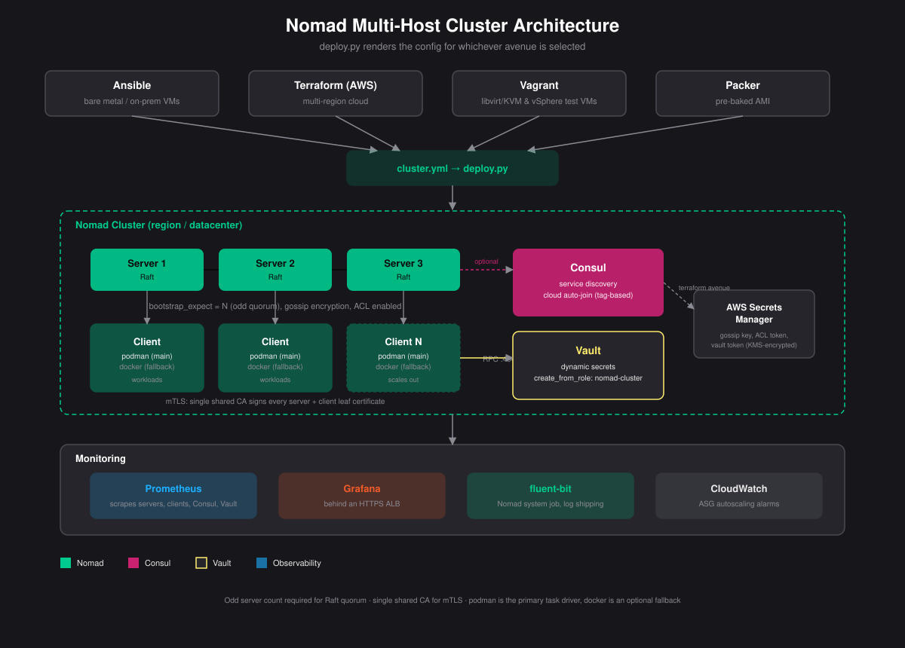

## nomad

Production-ready HashiCorp Nomad cluster deployment, supporting multiple hosts, multiple servers, and multiple provisioning avenues from a single config file.

<p align="center">
  
</p>

### Layout

```console
nomad/
├── deploy.py                  # single entry point: renders inventory/tfvars from cluster.yml, then invokes the right avenue
├── cluster.yml.example        # copy to cluster.yml and edit
├── ansible/                   # avenue: bare metal / on-prem VMs / anything reachable over SSH
│   └── roles/nomad/           # TLS (shared CA), ACLs, gossip encryption, Vault integration, Podman
├── terraform/                 # avenue: AWS, multi-region (primary + secondary)
│   ├── modules/               # vpc, nomad-cluster, consul-cluster, vault-cluster, monitoring
│   └── packer/                # pre-baked AMI with Nomad/Consul/Vault + Podman preinstalled
├── baremetal/                 # avenue: single-host quickstart, or a local libvirt/vSphere multi-VM test cluster via Vagrant
├── examples/jobs/             # example Nomad job specs (Consul Connect, fluent-bit sidecar)
└── tests/                     # tofu/tflint validation Dockerfile + static test suite
```

### Choosing an avenue

| Avenue | When to use it |
|---|---|
| `ansible` | Bare metal or existing VMs, any cloud or on-prem, SSH access |
| `terraform` | AWS, want managed infra (ASGs, Secrets Manager, monitoring) provisioned alongside the cluster |
| `baremetal/Vagrantfile` | Local multi-VM testing on KVM/QEMU (libvirt) or vSphere/ESXi before a real rollout |
| `baremetal/install-nomad.sh` | Single-node quickstart/dev, no cluster |

### Deploying

```bash
cp cluster.yml.example cluster.yml
# edit cluster.yml: avenue, server/client hosts (ansible) or region/counts (terraform)

python3 deploy.py --validate-only   # check cluster.yml before touching anything
python3 deploy.py --dry-run         # render inventory/tfvars and print the commands, don't run them
python3 deploy.py                   # deploy
```

`deploy.py` enforces an odd server count (Raft quorum requires 1, 3, 5, ...) and that `features.bootstrap_expect` matches the number of hosts listed, before it ever shells out to `ansible-playbook` or `terraform`.

### Design choices

- **Podman is the primary task driver; Docker is an optional fallback** (`nomad_podman_enabled`/`nomad_docker_enabled` in the ansible role, `podman_enabled` in the terraform nomad-cluster module).
- **A single shared CA signs every node's leaf certificate.** Generating an independent CA per host means no two nodes trust each other — see `ansible/roles/nomad/tasks/certificates.yml`.
- **No secrets ship with defaults.** `nomad_gossip_key` and `nomad_vault_token` must be supplied by the operator (ansible-vault) since every server needs the identical value; the terraform avenue generates them once into AWS Secrets Manager and fetches them at boot via IAM, never bakes them into a config file.
- **Nomad/Consul/Vault are pinned one point release back from the latest tag**, not bleeding-edge, after checking upstream changelogs for breaking config-schema changes — balancing security patches against stability.
- **Multi-server clustering uses cloud auto-join** (`retry_join = ["provider=aws tag_key=NomadType tag_value=server"]`) rather than a static IP list, so the AWS avenue's autoscaling groups can actually scale.

### Testing

`tests/Dockerfile` builds a self-contained image with OpenTofu and tflint (checksummed downloads, no bare `curl | sh`) with this whole directory baked in at `/workspace`, and runs `tests/run-tofu-checks.sh` against every `.tf` directory: `tofu fmt -check`, `tofu init -backend=false`, `tofu validate`, `tflint`. CI builds and runs it as-is; for local iteration, bind-mount over the baked-in copy to test uncommitted changes:

```bash
docker build -t nomad-tofu-tests -f tests/Dockerfile .
docker run --rm nomad-tofu-tests                              # CI-equivalent: tests the image as built
docker run --rm -v "$(pwd)":/workspace nomad-tofu-tests        # local iteration: tests the working tree
```

`tests/test_deploy.py` covers `deploy.py`'s config validation, inventory/tfvars rendering (`pip install -r tests/requirements.txt && pytest tests/`). `containers/tests/` (the repo-wide static suite) additionally validates every Dockerfile, compose file, and Kubernetes manifest under `nomad/`.

### What's next

See [`docs/enhancement-plan.md`](docs/enhancement-plan.md) for a gap analysis (security, HA, scaling, observability) and a proposed phasing for further work.
