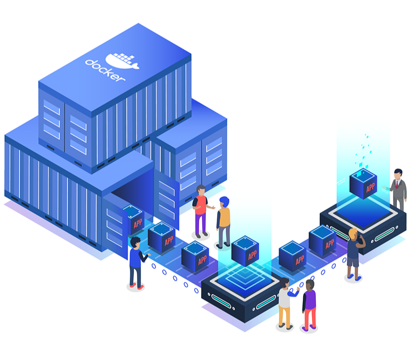

  

## Containers

A collection of containerized workloads, each in its own directory with the
Dockerfile and the configuration needed to build and deploy it. Every workload is
written to run across common orchestrators — Kubernetes, Red Hat OpenShift, HashiCorp
Nomad, Docker Compose, and Podman Compose.

Each directory is self-contained: its Dockerfile, compose file, Kubernetes manifests,
and any deploy scripts or tests live together, so a directory can be used on its own.

Depth varies by how heavily a workload is used. The core ones are fully built out —
production-grade deployments with multi-node topologies, autoscaling, Ansible roles,
and test suites — while the rest ship a solid baseline configuration to build on.

@RW