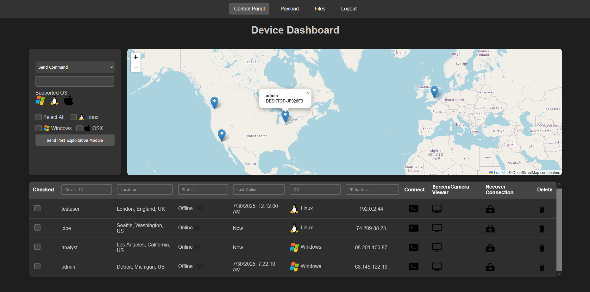
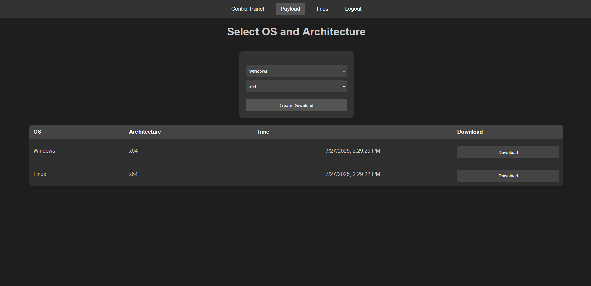
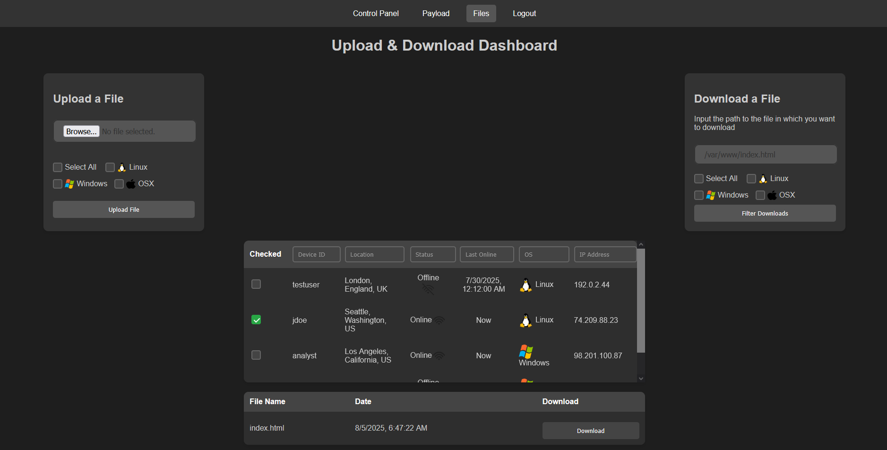
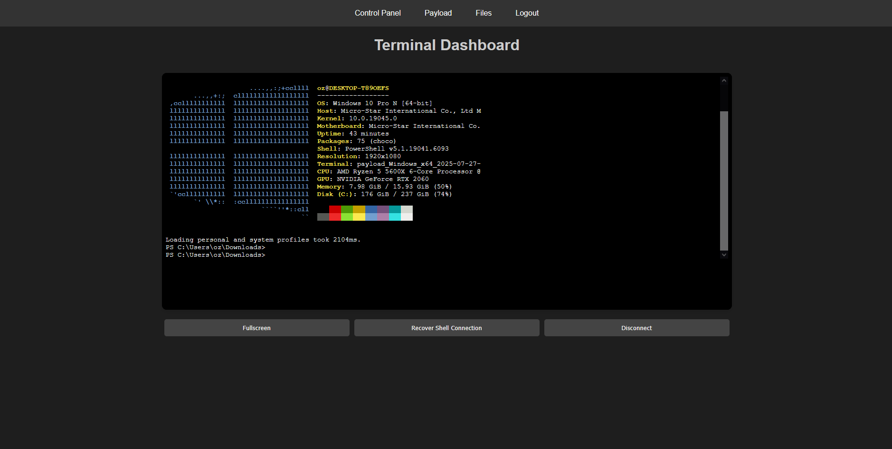
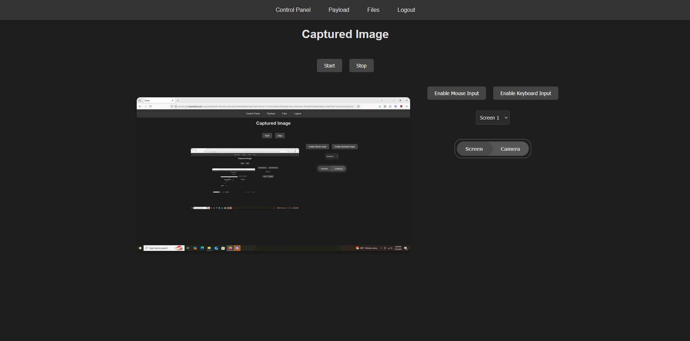
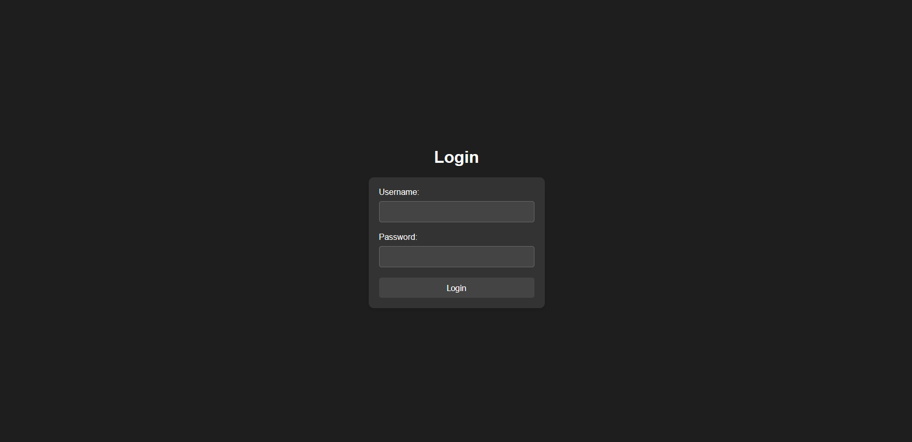

**DRILL** (Distributable Remote Integrated Lightweight Link) is a powerful and stealthy Command and Control (C2) framework designed for seamless operation across various environments.

```json
"disconnect-uid": {
    "os": ["windows", "linux"],
    "pem_path": "stop.py",
    "pem_name": "Disconnect Device"
}
```

---

### Main Dashboard


### Payload Generation


### File Upload/Download


### Console of Connected Device


### Screen/Camera Viewing


### Login Page


---

DRILL follows a typical C2 framework architecture:

1. **Agent**: Malware running on targeted systems, connecting back to the teamserver
2. **Teamserver**: Central backend service managing agent communications and operator interactions
3. **Client**: Web interface for operators to control the teamserver and issue commands

---

```bash
# Run the installer, avoid running it as root
cd DRILL_V3
bash ./install.sh
```

We recommend not running DRILL V3 behind a proxy as it can cause IP grabbing issues. Use an open port or tested services like ngrok or Cloudflare Tunnels.

---

```bash
# Basic usage example
python3 main.py
```

---

To change the default credentials, modify the configuration file located at `config.json`:

```bash
nano config.json
```

---

This project is for educational and authorized testing purposes only. The authors are not responsible for any misuse or damage caused by this software.

---
