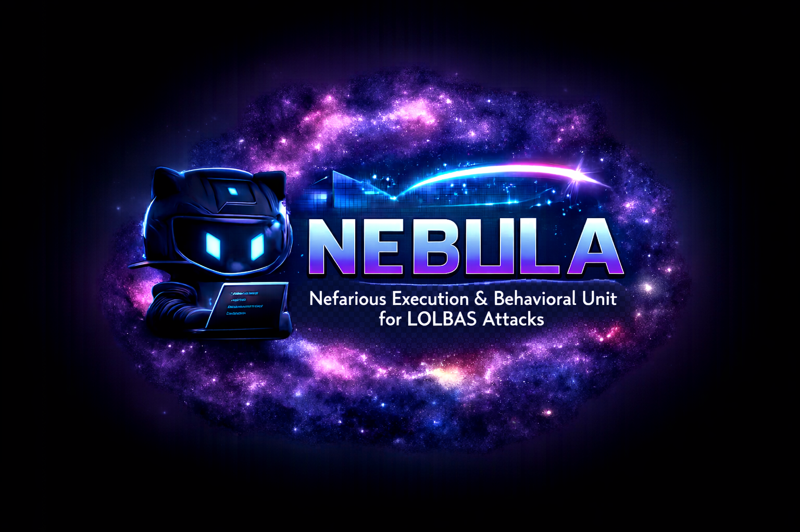
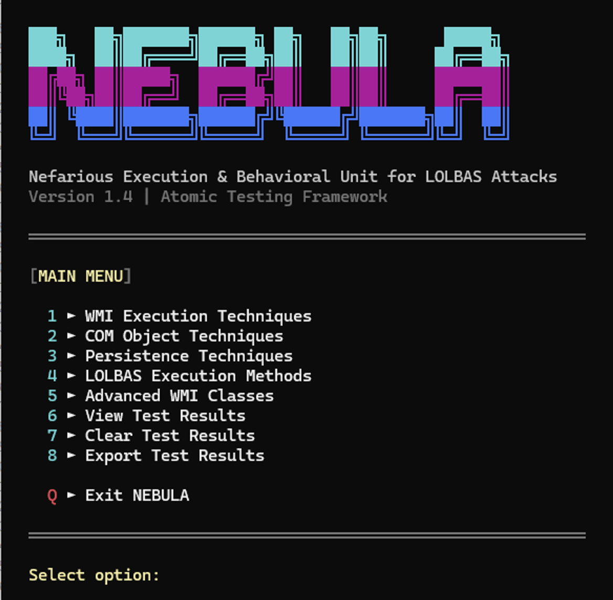
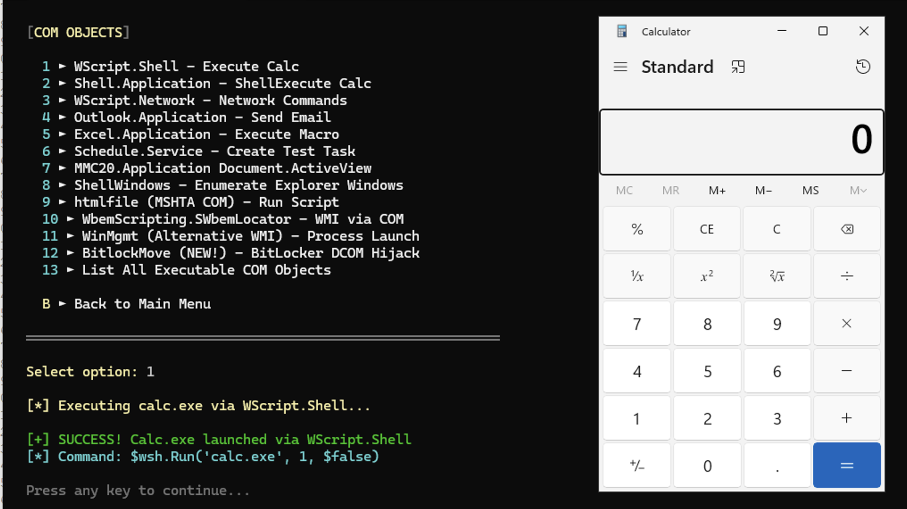

# NEBULA 🌌
<div align="center">
  
</div>

**Nefarious Execution & Behavioral Unit for LOLBAS Attacks**

An interactive PowerShell TUI for testing and exploring Windows execution techniques, COM objects, WMI methods, and LOLBAS (Living Off The Land Binaries and Scripts) techniques.

<div align="center">
  
</div>


## Overview

NEBULA is an atomic testing framework designed for security researchers, red teamers, and blue teamers to understand and test various Windows execution and persistence techniques in a controlled environment.

## Features

🎯 WMI Execution Techniques
💻 COM Object Techniques
🔒 Persistence Techniques
🛠️ LOLBAS Execution Methods
🔍 Advanced WMI Exploration

<div align="center">
  
  <p>NEBULA COM Menu</p>
</div>


## Usage

```powershell
# Run NEBULA
.\Launch-Nebula.bat

# Or from PowerShell
powershell.exe -ExecutionPolicy Bypass -File .\Nebula.ps1
```

## Navigation

NEBULA uses a clean, menu-driven interface:

- **Number keys (1-7)**: Select menu options
- **B**: Back to previous menu
- **Q**: Quit application

## Test Results Tracking

All executed tests are logged with:
- Timestamp
- Test name
- Technique used
- Status (SUCCESS/FAILED/ERROR/DRY-RUN)
- Details and output

View results anytime via the "View Test Results" menu option.


## Requirements

- Windows 10/11 or Windows Server 2016+
- PowerShell 5.1 or later
- Administrator privileges (for some techniques)

## Example Payloads

NEBULA includes example payloads in the `examples/` folder for testing LOLBAS techniques. These payloads are sourced from [Atomic Red Team](https://github.com/redcanaryco/atomic-red-team).

### Available Test Payloads

- **regsvr32_squiblydoo.sct** - RegSvr32 Squiblydoo technique (T1218.010)
- **mshta_calc.hta** - MSHTA remote HTA execution (T1218.005)
- **rundll32_calc.sct** - Rundll32 JavaScript protocol (T1218.011)
- **rundll32_javascript.txt** - Command reference for Rundll32 techniques
- **msbuild_inline_task.csproj** - MSBuild inline task execution (T1127.001)
- **certutil_download.txt** - CertUtil download technique reference (T1105)
- **bitsadmin_transfer.txt** - BITSAdmin background transfer reference (T1197)
- **installutil_bypass.txt** - InstallUtil AppLocker bypass reference (T1218.004)

All example payloads execute benign actions (e.g., launching calc.exe) for safe testing.

**Attribution**: Test payloads sourced from [Atomic Red Team](https://github.com/redcanaryco/atomic-red-team) © Red Canary


## Author

[@MHaggis](https://github.com/MHaggis)

## Acknowledgments

NEBULA utilizes test payloads from [Atomic Red Team](https://github.com/redcanaryco/atomic-red-team) by Red Canary.

Atomic Red Team is a library of tests mapped to the MITRE ATT&CK® framework. Security teams can use Atomic Red Team to quickly, portably, and reproducibly test their environments.

- **Atomic Red Team**: https://github.com/redcanaryco/atomic-red-team
- **Copyright**: © Red Canary

The example payloads in the `examples/` folder are derived from Atomic Red Team and modified for use with NEBULA's testing framework.


---

*"In the nebula of Windows internals, every technique leaves a trace."* ✨

