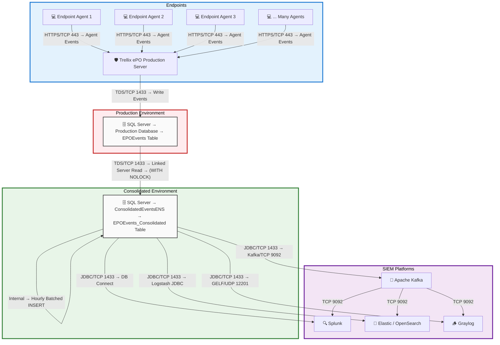

### Data Flow Topology Description
---

- **Agents to ePO Production**: Trellix ENS agents on endpoints continuously send events (threat detections, scans, etc.) to the central ePO server, which writes them to the production database (`ePO.dbo.EPOEvents`).

- **Production to Consolidated**: The dedicated consolidated SQL Server instance reads incrementally from production via a linked server. The stored procedure `SP_Sync_ENSEvents` performs batched, read-only pulls (`WITH (NOLOCK)`) using `AutoID` watermark for reliability and minimal impact.

- **Consolidated to SIEM**: SIEM platforms pull directly from `ConsolidatedEventsENS.dbo.EPOEvents_Consolidated`:
  - Splunk: DB Connect (rising column on `AutoID`).
  - Elastic/OpenSearch: Logstash JDBC input.
  - Graylog: Logstash with GELF output.
  - Optional: Kafka Connect for streaming to multiple consumers.

This architecture ensures:
- Zero write impact on production.
- Isolated analytical workload.
- Scalable, incremental ingestion for near-real-time SIEM visibility.